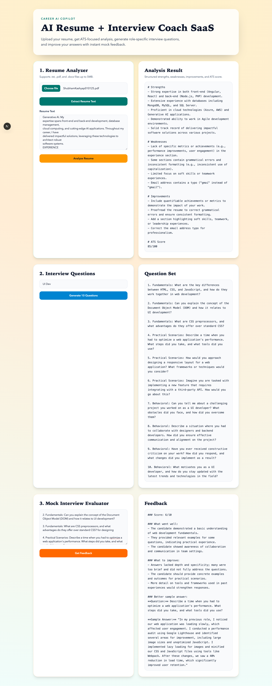

# AI Resume + Interview Coach

A full-stack SaaS-style app to:
- upload and parse resumes (`.txt`, `.pdf`, `.docx`)
- get ATS-focused resume analysis
- generate role-specific interview questions
- evaluate mock interview answers

## Tech Stack
- Backend: Node.js, Express, Multer, Mammoth, pdf-parse, OpenAI Chat Completions API
- Frontend: Next.js (App Router), React, Tailwind CSS

## Prerequisites
- Node.js 20+
- OpenAI API key in `.env`

## Environment
Create/update `.env` in project root:

```bash
OPENAI_API_KEY="your_openai_key_here"
```

## Run Locally

### Single command (backend + frontend)
```bash
npm run dev:all
```

### Or run separately

Backend (port 4000):
```bash
npm run dev
```

Frontend (port 3000):
```bash
npm run dev:frontend
```

Open `http://localhost:3000`.

## API Endpoints
- `GET /health`
- `POST /upload` (form-data: `resume`)
- `POST /analyze` (`{ "text": "..." }`)
- `POST /questions` (`{ "role": "Frontend Developer" }`)
- `POST /mock` (`{ "answer": "..." }`)

## Build Frontend
```bash
npm run build:frontend
```

## Test and Coverage

Run tests:

```bash
npm test
```

Run coverage:

```bash
npm run test:coverage
```

Latest coverage report:

- Test files: `1`
- Total tests: `10` (all passing)
- Statements: `81.01%`
- Branches: `54.34%`
- Functions: `91.66%`
- Lines: `82.05%`

Coverage output is generated in:

- `coverage/index.html`
- `coverage/coverage-summary.json`

## Full Code Analysis Report

Analysis scope (before commit):

- Backend API server: `index.js`
- Frontend app shell and UX flow: `frontend/app/page.tsx`, `frontend/app/layout.tsx`, `frontend/app/globals.css`
- Runtime and tooling config: `package.json`, `frontend/package.json`, `frontend/next.config.ts`, `frontend/eslint.config.mjs`, `frontend/tsconfig.json`

What was verified:

1. API contract consistency:
- Frontend payload keys (`text`, `role`, `answer`, `resume`) match backend route expectations.
- Backend validation paths correctly return user-friendly `400` errors for missing inputs.

2. Upload and parsing flow:
- File size limit is enforced at `5MB`.
- `.txt`, `.pdf`, `.docx` handling is implemented with clear unsupported-type errors.

3. OpenAI integration behavior:
- Requests are centralized through one helper.
- Missing `OPENAI_API_KEY` path is handled with explicit server error messaging.

4. Frontend UX and state logic:
- Independent loading states are used for resume upload vs resume analysis.
- Error feedback is surfaced in a dedicated alert block.
- Result areas support plain text/markdown-style output from backend prompts.

5. Quality gates:
- Automated test suite added and passing.
- Coverage generation added and passing.

Residual risk / next improvement target:

- Branch coverage is lower than statement/function coverage; additional tests can be added for:
  - OpenAI upstream failure mapping (`error.response.status` path)
  - Multer file-size overflow (`LIMIT_FILE_SIZE`)
  - Empty extraction result path for unreadable files

## Screenshots

Desktop:


